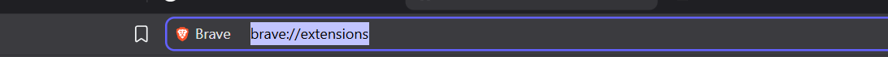
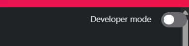
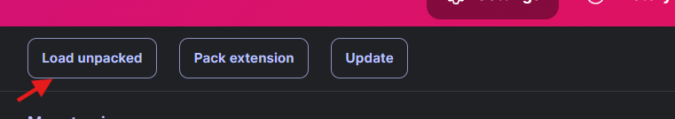
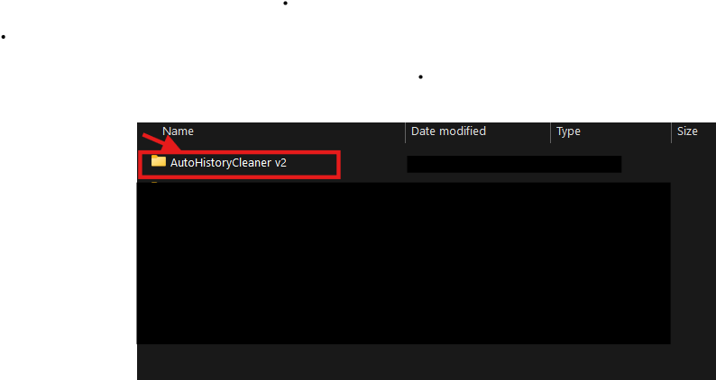
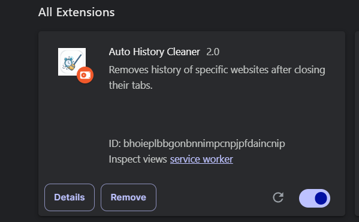
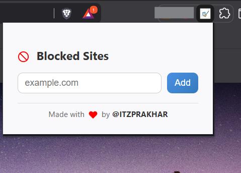

---

## ⚡ Installation (Unpacked Method)

Since this extension isn’t on the Chrome Web Store yet, you can install it manually:

1. **Download the project files**  
   - Either clone this repo or download the `.zip` and extract it.

2. **Open Extensions page**  
   - In Chrome: go to `chrome://extensions/`  
   - In Edge: go to `edge://extensions/`
   - In Brave: go to `brave://extensions/`

3. **Enable Developer Mode**  
   - Toggle the switch on the top-right corner.

4. **Load Unpacked Extension**  
   - Click **Load unpacked**  
   - Select the folder where `manifest.json` is located.

5. **Done! 🎉**  
   - The extension will now appear in your extensions bar.

---

## 🛠️ Development Notes

- If you make changes to the code, just click **Reload** on the extension card in `chrome://extensions/`.
- External CSS is linked through `style.css` for the popup. 

---

## 📸 Screenshots (Optional)

_Add screenshots here for better clarity._
1 - Go to Extension Page 

2 - Enable Developer Mode

3 - Click on Load Unpacked 

4 - Select the folder
 

5 - Now you will be able to see the extension

6 - Now on top Right Click on the extension icon and Click on the our extension

---

